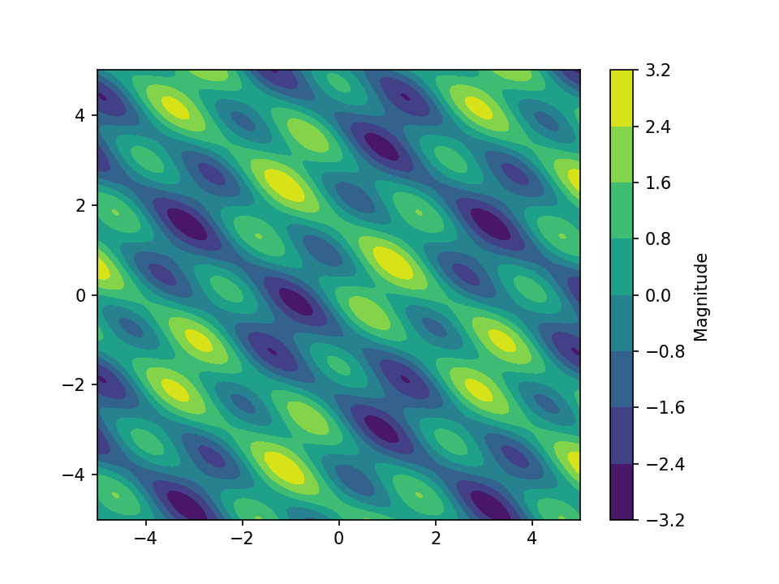
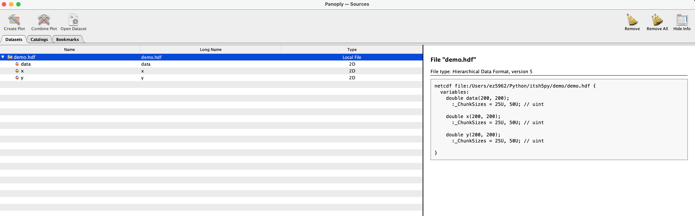
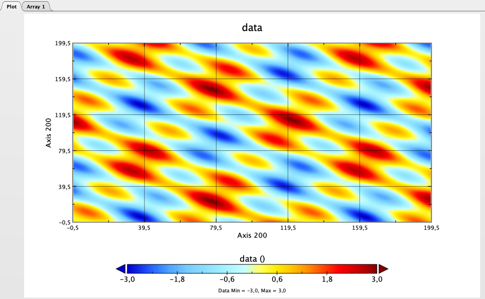
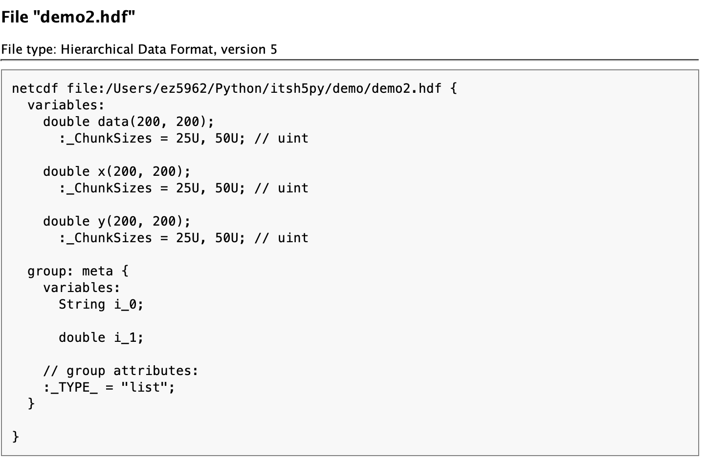

# Tutorial

Let's start with some sample data: Some coordinate arrays and a derived data
field:
```python
import numpy as np
import itsh5py

# Taken from mayavi examples!
x, y = np.mgrid[-5.:5.:200j, -5.:5:200j]
z = np.sin(x + y) + np.sin(2 * x - y) + np.cos(3 * x + 4 * y)
```

Saving this to hdf is obviously easy and possible with h5py. But it would mean
creating a file, datasets and filling this manually. Using `itsh5py`, this is
as easy as
```python
itsh5py.save('demo', {'x': x, 'y': y, 'data': z})
```
Still, this is a default *hdf* file which can be opened and inspected in tools
like *hdfview* or [Panoply][panoply]:




However, sometimes you just need to store some metadata with your file and
attributes just don't do it. Most of the types used in python are supported,
thus

```python
itsh5py.save('demo2', {'x': x, 'y': y, 'data': z, 'meta': ['type1', 2.]})
```
This can be inspected too:



As you can see, a mixed list is split into its elements since this type is
not supported. For other types, other conversions exist. They will be
visible when opening the files using `h5py` or similar but when loading them
using `itsh5py`, they are converted back.

Loading can be done in two ways: *Lazy*, which keeps everything possible with
weak references (default) or just loading all data. If lazy is active, the
result is a *LazyHdfDict*:
```python
lazy_demo = itsh5py.load('demo')
lazy_demo_2 = itsh5py.load('demo2')
itsh5py.config.use_lazy = False
basic_demo = itsh5py.load('demo')
basic_demo_2 = itsh5py.load('demo2')
```
Inspecting the results shows the following:
<details>
  <summary>Unfold to see</summary>

```python
basic_demo
{
    'data': array([[ 0.59925318,  0.47366702,  0.38353246, ..., -0.93771155,
        -0.65135851, -0.36662565],
       [ 0.52598534,  0.43316361,  0.37683558, ..., -0.80275349,
        -0.52186765, -0.24853893],
       [ 0.46326134,  0.40428732,  0.38196713, ..., -0.66053162,
        -0.39007068, -0.13290833],
       ...,
       [ 1.24416509,  1.14695653,  1.03256892, ..., -2.31421298,
        -2.40068459, -2.44342076],
       [ 1.09745781,  0.99214212,  0.87544695, ..., -2.36468556,
        -2.42493877, -2.44148253],
       [ 0.93395003,  0.82435405,  0.70941222, ..., -2.3818948 ,
        -2.41563926, -2.40663759]]),
    'x': array([[-5.        , -5.        , -5.        , ..., -5.        ,
        -5.        , -5.        ],
       [-4.94974874, -4.94974874, -4.94974874, ..., -4.94974874,
        -4.94974874, -4.94974874],
       [-4.89949749, -4.89949749, -4.89949749, ..., -4.89949749,
        -4.89949749, -4.89949749],
       ...,
       [ 4.89949749,  4.89949749,  4.89949749, ...,  4.89949749,
         4.89949749,  4.89949749],
       [ 4.94974874,  4.94974874,  4.94974874, ...,  4.94974874,
         4.94974874,  4.94974874],
       [ 5.        ,  5.        ,  5.        , ...,  5.        ,
         5.        ,  5.        ]]),
    'y': array([[-5.        , -4.94974874, -4.89949749, ...,  4.89949749,
         4.94974874,  5.        ],
       [-5.        , -4.94974874, -4.89949749, ...,  4.89949749,
         4.94974874,  5.        ],
       [-5.        , -4.94974874, -4.89949749, ...,  4.89949749,
         4.94974874,  5.        ],
       ...,
       [-5.        , -4.94974874, -4.89949749, ...,  4.89949749,
         4.94974874,  5.        ],
       [-5.        , -4.94974874, -4.89949749, ...,  4.89949749,
         4.94974874,  5.        ],
       [-5.        , -4.94974874, -4.89949749, ...,  4.89949749,
         4.94974874,  5.        ]])
}

basic_demo_2
{
    'data': array([[ 0.59925318,  0.47366702,  0.38353246, ..., -0.93771155,
        -0.65135851, -0.36662565],
       [ 0.52598534,  0.43316361,  0.37683558, ..., -0.80275349,
        -0.52186765, -0.24853893],
       [ 0.46326134,  0.40428732,  0.38196713, ..., -0.66053162,
        -0.39007068, -0.13290833],
       ...,
       [ 1.24416509,  1.14695653,  1.03256892, ..., -2.31421298,
        -2.40068459, -2.44342076],
       [ 1.09745781,  0.99214212,  0.87544695, ..., -2.36468556,
        -2.42493877, -2.44148253],
       [ 0.93395003,  0.82435405,  0.70941222, ..., -2.3818948 ,
        -2.41563926, -2.40663759]]),
    'meta': ['type1', 2.0],
    'x': array([[-5.        , -5.        , -5.        , ..., -5.        ,
        -5.        , -5.        ],
       [-4.94974874, -4.94974874, -4.94974874, ..., -4.94974874,
        -4.94974874, -4.94974874],
       [-4.89949749, -4.89949749, -4.89949749, ..., -4.89949749,
        -4.89949749, -4.89949749],
       ...,
       [ 4.89949749,  4.89949749,  4.89949749, ...,  4.89949749,
         4.89949749,  4.89949749],
       [ 4.94974874,  4.94974874,  4.94974874, ...,  4.94974874,
         4.94974874,  4.94974874],
       [ 5.        ,  5.        ,  5.        , ...,  5.        ,
         5.        ,  5.        ]]),
    'y': array([[-5.        , -4.94974874, -4.89949749, ...,  4.89949749,
         4.94974874,  5.        ],
       [-5.        , -4.94974874, -4.89949749, ...,  4.89949749,
         4.94974874,  5.        ],
       [-5.        , -4.94974874, -4.89949749, ...,  4.89949749,
         4.94974874,  5.        ],
       ...,
       [-5.        , -4.94974874, -4.89949749, ...,  4.89949749,
         4.94974874,  5.        ],
       [-5.        , -4.94974874, -4.89949749, ...,  4.89949749,
         4.94974874,  5.        ],
       [-5.        , -4.94974874, -4.89949749, ...,  4.89949749,
         4.94974874,  5.        ]])
}
```
</details>

Which is, while not pretty, what was expected since its the same as the input.

Taking a look at the *LazyHdfDict* is structured better:
```python
lazy_demo
demo.hdf
├─ /data::(200, 200)
├─ /x::(200, 200)
└─ /y::(200, 200)

lazy_demo_2
demo2.hdf
├─ /data::(200, 200)
├─ Group /meta
│  ├─ /meta/i_0::b'type1'
│  └─ /meta/i_1::2.0
├─ /x::(200, 200)
└─ /y::(200, 200)
```

You can always *unlazy* a *LazyHdfDict* by either calling `dict()` or using the
`.unlazy()` method. The latter is a wrapper that takes care of closing the
then unused reference.

## Attributes
Attributes can be used to add (scalar) quantities to *hdf* types (*Files*,
*Groups*, *Datasets*). They can be loaded using the `unpack_attrs` option to
`itsh5py.load()` which will place them in a `dict` called `attrs`. This is
off by default. Otherwise, they can be accessed via the `h5py` backend, see
below.

To quickly store some attributes with your data, you can use the same `attrs`
key:
```python
file = itsh5py.save('demo_att',
                    {'x': x, 'y': y, 'data': z,
                     'attrs': {'additional_str': 'meta_string',
                               'addition_float': 100.,
                               },
                     })
reloaded = itsh5py.load(file)
reloaded
demo_att.hdf
├─ /data::(200, 200)
├─ /x::(200, 200)
└─ /y::(200, 200)
```
While the attribute were added to the file, they are not loaded by default.
Access them via either of the two methods:
```python
[f'{k}: {v} (Type {type(v)})' for k, v in reloaded.h5file.attrs.items()]
["addition_float: 100.0 (Type <class 'numpy.float64'>)",
 "additional_str: meta_string (Type <class 'str'>)"]

reloaded = itsh5py.load(file, unpack_attrs=True)
reloaded['attrs']
{'addition_float': 100.0, 'additional_str': 'meta_string'}
```


## h5py Backend
After loading lazy (by default), the underlying *hdf* can be accessed
via the `LazyHdfDict.h5file` property. This allows the creation, extraction,
slicing and so on with all basic `h5py` methods on the file.

## Queue System
Open files (at least *lazy* ones) are stored in a queue. The handling Functions
are mostly hidden and do not need to be accessed. However there are two
things to not here: The amount of files open at once can be controlled via the
`itsh5py.max_open_files` attribute. Currently open files can be shown using
```python
itsh5py.open_filenames()
['demo2.hdf', 'demo.hdf']
```

There might be situations where large amounts of open files can be present, e.g.
in list comprehensions. This can be handled in two ways:
1. Setting `itsh5py.max_open_files` to a large number. Be aware that this,
combined with unlazy files, can be difficult for RAM and slow down the
process considerably.
2. Using `itsh5.config.allow_fallback_open = True` (defaults to `False`). Since
closing a *LazyHdfDict* does not remove the *python* instance, this allows to
reopen a file on the fly to access unwrapped data from a previously open file.
This will only open the file to get the data and subsequently close it again,
preventing memory issues but also slowing down the process.


[panoply]: https://www.giss.nasa.gov/tools/panoply/
